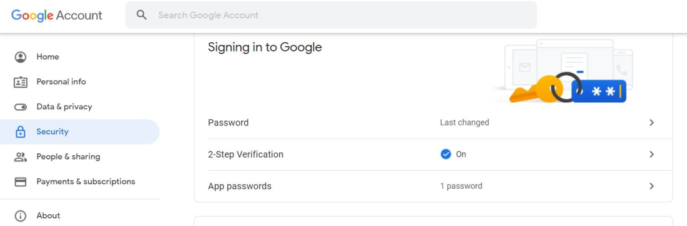
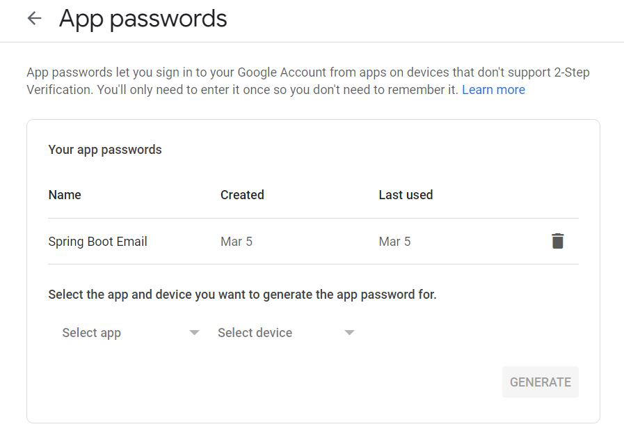

## Spring Boot - Sending Email via SMTP

## Step 1: Adding the spring-boot-starter-mail dependency in pom.xml.
````xml
<dependency>
    <groupId>org.springframework.boot</groupId>
    <artifactId>spring-boot-starter-mail</artifactId>
</dependency>
````

## Step 2: Setting up Application.properties file with configurations required for using Gmail SMTP server.
````properties
spring.mail.host=smtp.gmail.com
spring.mail.port=587
spring.mail.username=<Login User to SMTP server>
spring.mail.password=<Login password to SMTP server>
spring.mail.properties.mail.smtp.auth=true
spring.mail.properties.mail.smtp.starttls.enable=true
````

The Gmail Id used to login into your Gmail account can be provided as the username. For password generation, 2-step verification needs to be enabled for your account as follows:



Following that, AppPassword needs to be created using the following path:

````scss
Login to Gmail 
    -> Manage your Google Account 
        -> Security 
            -> App Passwords 
                -> Provide your login password 
                    -> Select app with a custom name 
                        -> Click on Generate
````



> **Note: For reference,**<br/>
If you don’t find the App Password option under Security even after enabling 2-step verification, you might be encountering an issue detailed in this Google Support Thread on App Passwords.<br/><br/>
To generate an App Password, visit the [Google App Passwords page](https://myaccount.google.com/apppasswords). This page will guide you through the process of creating an App Password for your Gmail account.